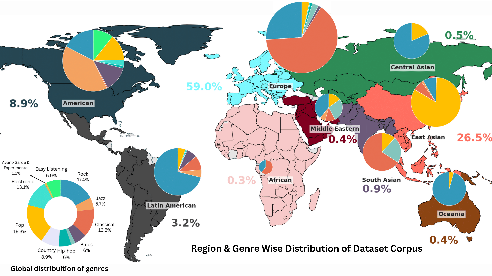

# Music4All
This repository contains our code for the paper:  "Music for All : Representational bias and cross-cultural adaptability in Music generation models."

[Survey](https://atharva20038.github.io/aimusicexamples.github.io/) | [Model](https://huggingface.co/collections/athi180202/music4all-67a0778b5b562859c2a9a8e1) | [Paper](https://arxiv.org/abs/2311.08355)

[](https://huggingface.co/collections/athi180202/music4all-67a0778b5b562859c2a9a8e1)

The advent of Music-Language Models has greatly enhanced the automatic music generation capability of AI systems, but they are also limited in their coverage of the musical genres and cultures of the world. We present a study of the datasets and research papers for music generation and quantify the bias and under-representation of genres. We find that only **5.7\%** of the total hours of existing music datasets come from non-Western genres, which naturally leads to disparate performance of the models across genres. 
We then investigate the efficacy of Parameter-Efficient Fine-Tuning (PEFT) techniques in mitigating this bias. Our experiments with two popular models -- MusicGen and Mustango, for two underrepresented non-Western music traditions --  **Hindustani Classical** and **Turkish Makam** music, highlight the promises as well as the non-triviality of cross-genre adaptation of music through small datasets, implying the need for more equitable baseline music-language models that are designed for cross-cultural transfer learning.

## Global Music Generation Analysis
<div align="center">
  
</div>

## Datasets

The [Compmusic](https://compmusic.upf.edu/datasets) dataset contains 120+ hours of Turkish Makam and Hindustani Classical data.

The [MTG-Saraga](https://mtg.github.io/saraga/) dataset contains 40+ hours of Hindustani Classical annotated data. 

## Evaluations


## Citation
Please consider citing the following article if you found our work useful:
```
@misc{melechovsky2023mustango,
      title={Mustango: Toward Controllable Text-to-Music Generation}, 
      author={Jan Melechovsky and Zixun Guo and Deepanway Ghosal and Navonil Majumder and Dorien Herremans and Soujanya Poria},
      year={2023},
      eprint={2311.08355},
      archivePrefix={arXiv},
}
```