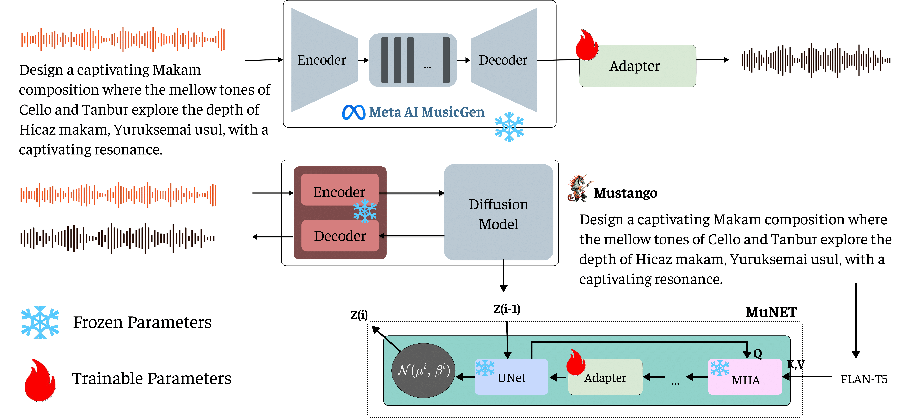

# Music4All
This repository contains our code for the paper:  "Music for All : Representational bias and cross-cultural adaptability in Music generation models."

[Survey](https://atharva20038.github.io/aimusicexamples.github.io/) | [Model](https://huggingface.co/collections/athi180202/music4all-67a0778b5b562859c2a9a8e1) | [Paper]()

[](https://huggingface.co/collections/athi180202/music4all-67a0778b5b562859c2a9a8e1)

We present a study of the datasets and research papers for music generation and quantify the bias and under-representation of genres. We find that only **5.7\%** of the total hours of existing music datasets come from non-Western genres, which naturally leads to disparate performance of the models across genres. 
We then investigate the efficacy of *Parameter-Efficient Fine-Tuning (PEFT)* techniques in mitigating this bias. Our experiments with two popular models -- **[MusicGen](https://arxiv.org/abs/2306.05284)** and **[Mustango](https://arxiv.org/abs/2311.08355)**, for two underrepresented non-Western music traditions --  **Hindustani Classical** and **Turkish Makam** music, highlight the promises as well as the non-triviality of cross-genre adaptation of music through small datasets, implying the need for more equitable baseline music-language models that are designed for cross-cultural transfer learning.

## Global Music Generation Analysis
<div align="center">
  
</div>

## Datasets

The [Compmusic](https://compmusic.upf.edu/datasets) dataset contains 120+ hours of Turkish Makam and Hindustani Classical data.

The [MTG-Saraga](https://mtg.github.io/saraga/) dataset contains 40+ hours of Hindustani Classical annotated data. 

## Adapter Positioning

<div align="center">
  
</div>

### Mustango
To enhance this process, a Bottleneck Residual Adapter with convolution layers is integrated into the up-sampling, middle, and down-sampling blocks of the UNet, positioned just after the cross-attention block. This design facilitates cultural adaptation while preserving computational efficiency. The adapters reduce channel dimensions by a factor of 8, using a kernel size of 1 and GeLU activation after the down-projection layers to introduce non-linearity.

### MusicGen
In MusicGen, we enhance the model with an additional 2 million parameters by integrating Linear Bottleneck Residual Adapter after the transformer decoder within the MusicGen architecture after thorough experimentation with other placements.

The total parameter count of both the models is ~2 billion, making the adapter only 0.1% of the total size (2M params).

For both models we used two RTX A6000 GPUs over a period of around 10 hours. The adapter block was fine-tuned, using the AdamW optimizer using MSE (Reconstruction Loss).

## Evaluations
## **Objective Evaluation Metrics for Music Models**

The table below presents the **objective evaluation metrics** for **Hindustani Classical Music** and **Turkish Makam**, assessing the quality of generated music based on **Fréchet Audio Distance (FAD)**, **Fréchet Distance (FD)**, **Kullback-Leibler Divergence (KLD)**, and **Peak Signal-to-Noise Ratio (PSNR)**.

<div style="display: flex; flex-direction: row; justify-content: space-between;">

<!-- Hindustani Classical Music Table -->
<table style="width:45%">
<caption><b>Hindustani Classical Music</b></caption>
<tr>
<th>Model</th><th>FAD ↓</th><th>FD ↓</th><th>KLD ↓</th><th>PSNR ↑</th>
</tr>
<tr><td><b>MGB</b></td><td>40.05</td><td>75.76</td><td>6.53</td><td>16.23</td></tr>
<tr><td><b>MGF</b></td><td>40.04</td><td>72.65</td><td>6.12</td><td>16.18</td></tr>
<tr><td><b>MTB</b></td><td>6.36</td><td>45.31</td><td>2.73</td><td>16.78</td></tr>
<tr><td><b>MTF</b></td><td><b>5.18</b></td><td><b>22.03</b></td><td><b>1.26</b></td><td><b>17.70</b></td></tr>
</table>
<!-- Turkish Makam Table -->
<table style="width:45%">
<caption><b>Turkish Makam</b></caption>
<tr>
<th>Model</th><th>FAD ↓</th><th>FD ↓</th><th>KLD ↓</th><th>PSNR ↑</th>
</tr>
<tr><td><b>MGB</b></td><td>39.65</td><td>57.29</td><td>7.35</td><td>14.60</td></tr>
<tr><td><b>MGF</b></td><td>39.68</td><td>56.71</td><td>7.21</td><td>14.46</td></tr>
<tr><td><b>MTB</b></td><td>8.65</td><td>75.21</td><td>6.01</td><td><b>16.60</b></td></tr>
<tr><td><b>MTF</b></td><td><b>2.57</b></td><td><b>20.56</b></td><td><b>4.81</b></td><td>16.17</td></tr>
</table>

</div>


## Citation
Please consider citing the following article if you found our work useful:
```
@misc{melechovsky2023mustango,
      title={Mustango: Toward Controllable Text-to-Music Generation}, 
      author={Jan Melechovsky and Zixun Guo and Deepanway Ghosal and Navonil Majumder and Dorien Herremans and Soujanya Poria},
      year={2023},
      eprint={2311.08355},
      archivePrefix={arXiv},
}
```